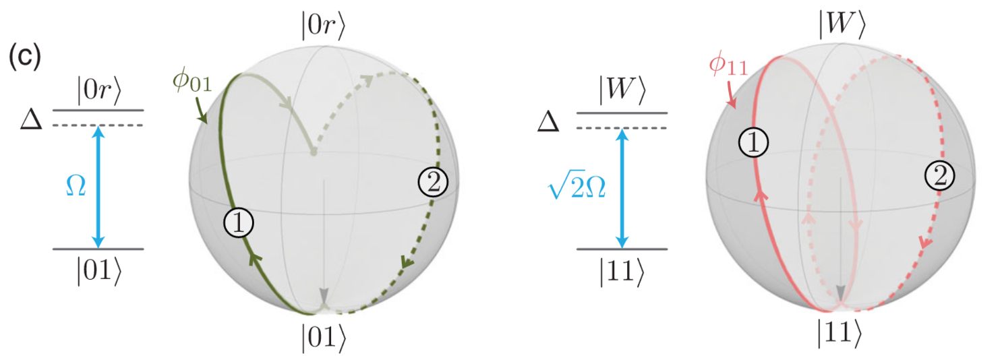

```@meta
CurrentModule = Bloqade
```

# Hamiltonian in a 3-level system

The Hamiltonian in a 3-level system is similar to a 2-level system. It also 
consists of Rabi terms, detuning terms, and Rydberg interaction between 
atoms but with more levels. The convention we used for a 3-level system 
Hamiltonian is 
```math
i \hbar \dfrac{\partial}{\partial t} | \psi \rangle = \hat{\mathcal{H}}(t) | \psi \rangle,  \\

\begin{aligned} 
    \frac{\mathcal{H}(t)}{\hbar} = & \sum_i \frac{\Omega_i^{\mathrm{hf}}(t)}{2}\left(e^{i \phi_i^{\mathrm{hf}}(t)}|0_i\rangle\langle 1_i|+e^{-i \phi_i^{\mathrm{hf}}(t)}| 1_i\rangle\langle 0_i|\right)-\sum_i \Delta_i^{\mathrm{hf}}(t)|1_i\rangle\langle 1_i| \\ 
    & +\sum_i \frac{\Omega_i^{\mathrm{r}}(t)}{2}\left(e^{i \phi_i^{\mathrm{r}}(t)}|1_i\rangle\langle r_i|+e^{-i \phi_i^{\mathrm{r}}(t)}| r_i\rangle\langle 1_i|\right)-\sum_i\left[\Delta_i^{\mathrm{hf}}(t)+\Delta_i^{\mathrm{r}}(t)\right]\left|r_i\right\rangle\left\langle r_i\right| \\ 
    & +\sum_{i<j} V_{i j}\left|r_i\right\rangle\left\langle r_i|\otimes| r_j\right\rangle\left\langle r_j\right| .
\end{aligned}
```

Here, ``|0\rangle`` and ``|1\rangle`` represent two different hyperfine levels 
in a atom. And ``|r\rangle`` represent the Rydberg level we use for entangling 
different atoms. There are two seperated pulses: the first one couples two 
hyperfine levels ``|0\rangle`` and ``|1\rangle`` and the second couples the 
hyperfine level ``|1\rangle`` and the Rydberg level ``|r\rangle``. We use two 
different superscripts ``\mathrm{hf}`` and ``\mathrm{r}`` to indicate them 
respectively.

With `ArrayReg` in `YaoArrayRegister`, we use ``|0\rangle``, ``|1\rangle``, and ``|2\rangle`` to 
represent ``|0\rangle``, ``|1\rangle``, and ``|r\rangle``, respectively. 


## Interface for the 3-level Hamiltonian

The interface for defining a 3-level Rydberg Hamiltonian is [`rydberg_h_3`](@ref). It is similar as the 
2-level interface [`rydberg_h`](@ref). The only difference is that, in 3-level you need to specify the Rabi term 
``(\Omega, \phi)`` and the detunning term ``(\Delta)`` for both hyperfine coupling 
``(\Omega^{\mathrm{hf}}, \phi^{\mathrm{hf}}, \Delta^{\mathrm{hf}})`` and rydberg coupling 
``(\Omega^{\mathrm{r}}, \phi^{\mathrm{r}}, \Delta^{\mathrm{r}})``. And both time-dependent and site-dependent waveforms are supported for each parameter (see [Hamiltonians](@ref) for details about defining different waveforms).


## Pulse sequences and quantum gates

We can use two hyperfine levels to represent a qubit. In this case 
single-qubit gates can be directly obtained using hyperfine coupling in the 
3-level system, and two-qubit gates can also be implemented by the coupling 
between ``|1\rangle`` and ``|r\rangle`` with the assist of Rydberg interation 
between different Rydberg atoms. In general, any n-qubit unitary can be 
approximated by a 3-level Rydberg pulse sequence. Hence, the 3-level Rydberg 
system is universal for qubit quantum computation.

### Single-qubit gates

Here is an example for applying a Pauli ``X`` gate (acting on hyperfine levels 
``|0\rangle`` and ``|1\rangle``) to each site. Notes that single qubit gates 
could be parallelize, that is implementing the same single qubit gate on 
different sites with only one pulse.
```@repl 3-level-single-qubit
using Bloqade
atoms = generate_sites(ChainLattice(), 5, scale=5)
h = rydberg_h_3(atoms; Ω_hf = 1.0)
reg = zero_state(5; nlevel = 3); # the initial state is an all-zero state
prob = KrylovEvolution(reg, 0.0:1e-2:pi, h); # an X gate is a π-pulse
emulate!(prob);
measure(reg) # the final state is an all-one state
```

### Two-qubit gates

Two-qubit gates can be implemented with the assist of Rydberg interaction 
between two atoms. Here we give two example of different implementation of 
the CZ-gate using the 3-level Rydberg system. 

- 5-pulse CZ-gate
- The Levine-Pichler gate

Notes that the gate set of arbitrary single-qubit gate + CZ-gate is universal. 
Hence, 3-level Rydberg system is universal for quantum computing.

### 5-pulse CZ-gate

Suppose we have two atoms which are cloesed to each other so that there is 
Rydberg blockade between them. And the first atom is the controlling qubit 
while the second atom is the target qubit. 
```@repl 3-level-5-pulse-CZ
using Bloqade
atoms = generate_sites(ChainLattice(), 2; scale = 4)
```

There are 5 steps in total for the CZ-gate. 
1. Apply an X-gate (hyperfine π-pulse) on each qubit to flip ``|0\rangle`` and ``|1\rangle``
2. Apply an Rydberg π-pulse on the controlling qubit
3. Apply an Rydberg 2π-pulse on the target qubit
4. Apply an Rydberg π-pulse on the controlling qubit
5. Apply an X-gate (hyperfine π-pulse) on each qubit to flip ``|0\rangle`` and ``|1\rangle``

To understand the above steps, let us consider two different cases when the 
controlling qubit starts with ``|0\rangle`` and ``|1\rangle``.
- If the controlling qubit starts with ``|0\rangle``, then after step 2 it will be 
excited into the Rydberg state ``|r\rangle``. Because of the Rydberg blockade, the 
pulse in step 3 act trivially but a global phase -1 onto the target qubit. 
This means nothing changes but a global phase -1 if controlling qubit is ``|0\rangle``.
- If the controlling qubit is started with ``|1\rangle``, then after step 2 it will 
become the hyperfine state ``|0\rangle`` which will not affect the pulse in step 3. 
In this case, the 2π-pulse will cause a phase -1 only if the target qubit 
is ``|1\rangle`` after step 2 (which means the target qubit starts with ``|0\rangle``). This 
means a Z-gate upto a global phase -1 is applied on the target qubit when 
the controlling qubit is ``|1\rangle``.

The following codes implement the above 5-steps of the CZ-gate.
```@repl 3-level-5-pulse-CZ
using Bloqade
using Yao
atoms = generate_sites(ChainLattice(), 2; scale = 4)
st = zeros(ComplexF64, 9); st[[1, 2, 4, 5]] .= 1/2; # [1, 2, 4, 5] are indices for hyperfine states
reg = arrayreg(st; nlevel = 3)  # initialize the state with 1/2 (|00⟩ + |01⟩ + |10⟩ + |11⟩) 
hs = [
    rydberg_h_3(atoms; Ω_hf = [1.0, 1.0]),  # hyperfine pulse for step 1
    rydberg_h_3(atoms; Ω_r = [1.0, 0.0]),   # Rydberg pulse for step 2
    rydberg_h_3(atoms; Ω_r = [0.0, 1.0]),   # Rydberg pulse for step 3
    rydberg_h_3(atoms; Ω_r = [1.0, 0.0]),   # Rydberg pulse for step 4
    rydberg_h_3(atoms; Ω_hf = [1.0, 1.0]),  # hyperfine pulse for step 5
]   # Hamiltonians for step 1-5
ts = [π, π, 2π, π, π]   # pulse time for step 1-5
step = 1e-3; # Krylov time step
for i = 1:5
    prob = KrylovEvolution(reg, 0.0:step:ts[i], hs[i])
    emulate!(prob)
end
state(reg)[1, 2, 4, 5]  # equivalent to 1/2 (|00⟩ + |01⟩ + |10⟩ - |11⟩) 
```

#### The Levine-Pichler gate

A more efficient way to implementing the CZ-gate is using the 
[Levine-Pichler gate](https://journals.aps.org/prl/abstract/10.1103/PhysRevLett.123.170503). 
Comparing to the above 5-pulse CZ-gate, the Levine-Pichler gate uses shorter 
sequence and less time. 

Consider two atoms which are closed to each other. If we apply a pulse that 
couples ``|1\rangle`` and ``|r\rangle`` with the Rabi frequency 
``\Omega^\mathrm{r}``, detunning ``\Delta^\mathrm{r}``, and duration 
``\tau``, then the dynamics of four hyperfine state are different.

- ``|00\rangle`` will not change during the pulse
- ``|01\rangle`` (``|10\rangle``) will oscillate between ``|01\rangle`` and ``|0r\rangle`` (``|10\rangle`` and ``|r0\rangle``) with a frequency ``\Omega^\mathrm{r}``
- ``|11\rangle`` will oscillate between ``|11\rangle`` and ``|w\rangle = \frac{1}{2}\left( |1r\rangle + |r1\rangle \right)`` with a frequency ``\sqrt{2}\Omega^\mathrm{r}`` (this is an approximation when the Rydberg blockade is strong enough such that the population of ``|rr\rangle`` could be ignored)

The Levine-Pichler gate consists of two global pulses. Together with a global hyperfine pulse for rotation-Z gates, we will get a CZ-gate.

1. A global Rydberg pulse with parameters ``\frac{\Delta^\mathrm{r}}{\Omega^\mathrm{r}} \approx 0.377371``, ``\phi^\mathrm{r} = 0``, ``\Omega^\mathrm{r}\tau \approx 4.29268``
2. A global Rydberg pulse with parameters ``\frac{\Delta^\mathrm{r}}{\Omega^\mathrm{r}} \approx 0.377371``, ``\phi^\mathrm{r} \approx 3.90242``, ``\Omega^\mathrm{r}\tau \approx 4.29268``
3. A global hyperfine pulse with parameters ``\Delta^\mathrm{r}\tau = 2\pi - \alpha \approx 3.90242``, ``\Omega^\mathrm{r} = \phi^\mathrm{r} = 0``

The first pulse completes a full cycle of oscillation for ``|11\rangle`` while it 
does not complete a cycle for ``|01\rangle`` and ``|10\rangle``. The only difference 
between the first and the second pulse is the parameter ``\phi^\mathrm{r}``. This 
difference causes a change of the rotation axis on the Bloch sphere, such that the 
second pulse completes another full cycle of oscillation for ``|11\rangle`` while it 
also brings back ``|01\rangle`` and ``|10\rangle``. After these two pulses has a unitary representation 
```math
\begin{pmatrix}
1 & & & \\
& e^{i\alpha} & & \\
& & e^{i\alpha} & \\
& & & e^{i(2\alpha-\pi)}
\end{pmatrix},
```
which is a CZ-gate with single qubit rotation gates ``R_Z(\alpha)`` on each qubit.
The following picture (Fig 2 c) in [the original paper](https://journals.aps.org/prl/abstract/10.1103/PhysRevLett.123.170503)) 
demonstrates the process of the first pulse and the second pulse.


Here are codes for the Levine-Pichler gate.
```@repl 3-level-levine-pichler
using Bloqade
using Yao
st = zeros(ComplexF64, 9); st[[1, 2, 4, 5]] .= 1/2; # [1, 2, 4, 5] are indices for hyperfine states
reg = arrayreg(st; nlevel = 3); # initialize the state with 1/2 (|00⟩ + |01⟩ + |10⟩ + |11⟩) 
atoms = generate_sites(ChainLattice(), 2; scale = 4);
Ω_r = 1.0; ϕ_r = 3.90242; Δ_r = 0.377371*Ω_r;   # define parameters
τ = 4.29268/Ω_r; α = 2.38076;   # define pulse durations
step = 1e-3;    # Krylov step
hs = [
    rydberg_h_3(atoms; Ω_r = Ω_r, Δ_r = Δ_r),   # global Rydberg pulse for step 1
    rydberg_h_3(atoms; Ω_r = Ω_r, ϕ_r = ϕ_r, Δ_r = Δ_r),    # global Rydberg pulse for step 2
    rydberg_h_3(atoms; Δ_hf = 1.0), # global hyperfine pulse for R_Z-gate in step 3
]
ts = [τ, τ, 2π - α]
for i = 1:3 # simulation
    prob = KrylovEvolution(reg, 0:step:ts[i], hs[i])
    emulate!(prob)
end
state(reg)[[1, 2, 4, 5]]  # desired state 1/2 (|00⟩ + |01⟩ + |10⟩ - |11⟩) 
```

### Predefined pulse sequences for different quantum gates

Instead of defining pulse sequences manually, we provide lots of predefined pulse 
sequences for basic quantum gates. For more details, please refer to the package 
[`BloqadeGates`](https://github.com/QuEraComputing/Bloqade.jl/tree/master/lib/BloqadeGates).


## References

The 3-level Rydberg Hamiltonian:

```@docs
rydberg_h_3
```

The following operators only for 3-level system are also supported by Bloqade.

### Single site operators

```@docs
X_01
X_1r
N_1
N_r
Pu_01
Pu_1r
Pd_01
Pd_1r
Bloqade.BloqadeExpr.Z_01
Bloqade.BloqadeExpr.Z_1r
XPhase_01
XPhase_1r
```

### Sum of operators

```@docs
SumOfX_01
SumOfX_1r
SumOfXPhase_01
SumOfXPhase_1r
SumOfN_1
SumOfN_r
SumOfZ_01
SumOfZ_1r
```