# [Installation](@id install)

You can copy the following line to your Julia REPL
to install the latest stable version of this package:

```julia
pkg> add Bloqade
```

## Low-Latency Usage of Bloqade Component Packages

The Bloqade project contains multiple packages. For development on top of functionality,
(especially for those who do not need the ODE solvers), we recommend you use the corresponding
component packages. The following is a list of component packages and what they do (WIP = work-in-progress)

- BloqadeExpr: Expressions and API definitions for Bloqade.
- BloqadeKrylov: Krylov-subspace based emulation.
- BloqadeLattices: objects, functions for lattices.
- BloqadeMIS: tools for working with maximum-independent sets in Rydberg system.
- BloqadeODE: ODE-based emulation.
- BloqadePython: WIP, python wrapper for the Bloqade package.
- BloqadeQMC: WIP, Stochastic Series Expansion for Rydberg system.
- BloqadeSchema: WIP, the schema for creating a task for Bloqade and QuEra machine.
- BloqadeWaveforms: the waveform objects.
- YaoSubspaceArrayReg: register object and functions in a subspace.

All the non-WIP packages are registered in the General registry. Thus, you can add them
as your dependency by directly running `pkg> add <component package>` in your Julia REPL.

## Try the Latest Version of Bloqade

Some users may want to try the latest version of Bloqade
for bug fixes, new features, etc. One can use `git` to clone the
repo to try the latest version of the entire package. This
requires one to setup the local project environment via `dev`.
Please refer to the page [Contributing to Bloqade](@ref) for more information.

If you only want to try the latest version of a specific
Bloqade package, just add `#master` after the package name, e.g.:

```julia
pkg> add BloqadeExpr#master
```

## Using Bloqade with Amazon EC2

Bloqade can be deployed on any personal computer although some users might benefit from the extra performance offered by large computational resources from different providers. To address that, Bloqade is also available on the Amazon Web Services (AWS) Marketplace, and can run on Amazon EC2 instances by deploying Amazon Machine Images (AMIs) onto them. More information about the AMIs and how to deploy them onto EC2 instances can be found below.

### Bloqade AMIs

There are two AMIs offered by the Bloqade team:

#### Bloqade AMI (Base Image)

Built on top of Ubuntu Server 20.04 LTS, this image includes
- The latest version of Julia and Bloqade
- [Yao.jl](https://yaoquantum.org/)
- [Revise.jl](https://github.com/timholy/Revise.jl)
- [BenchmarkTools.jl](https://juliaci.github.io/BenchmarkTools.jl/stable/)
- [PythonCall.jl](https://cjdoris.github.io/PythonCall.jl/stable/) 
- Conda package manager, provided by [Miniconda](https://docs.conda.io/en/latest/miniconda.html) 

#### Bloqade CUDA AMI

Built on top of an Amazon DLAMI (Deep Learning AMI) on Ubuntu 20.04, this AMI includes everything from the Base Image above along with:

- NVIDIA CUDA
- cuDNN
- NCCL
- GPU Drivers
- Intel MKL-DNN
- Docker
- NVIDIA-Docker
- EFA support
- Support for Block devices

as well as:

- [CUDA.jl](https://github.com/JuliaGPU/CUDA.jl)
- [Adapt.jl](https://github.com/JuliaGPU/Adapt.jl) 

Both of which are needed for Bloqade to take advantage of GPUs (see [GPU Acceleration](@ref cuda) for more on how to do this). 

### Disclaimers
!!! info
    - Deploying Bloqade on Amazon EC2 instances will incur a cost on the user that will depend on the AWS resources utilized.  
    - Support on deploying Bloqade on AWS can be obtained via AWS Support. This is a one-on-one support channel that is staffed 24x7x365 with experienced support engineers. To learn more, follow [this link](https://aws.amazon.com/premiumsupport/).

### Step 0: Set Your AWS Region

For general guidelines on launching EC2 instances, check out the [Amazon EC2 tutorial](https://docs.aws.amazon.com/AWSEC2/latest/UserGuide/EC2_GetStarted.html).
Bloqade can technically be run from any location but its images are hosted on servers in AWS' North Virginia (N. Virginia) region. To get started as easily as possible, set your AWS region location to N. Virginia (us-east-1).


### Step 1: Access the EC2 Service

Now to really get started. On your AWS account portal, type EC2 on the search bar and access the EC2 Service

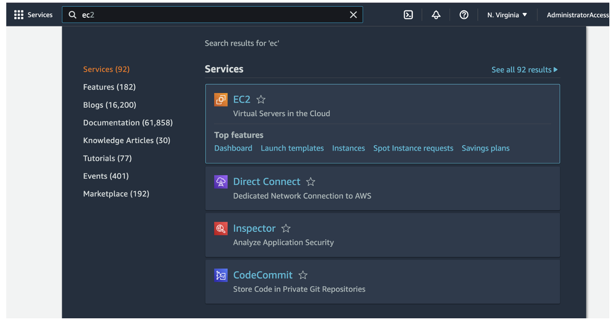

### Step 2: Launch Your Instance

Find the "Launch Instance" button, circled in red, to create one. To see all currently running instances, click the "Instances (running)" button, indicated by the red arrow.

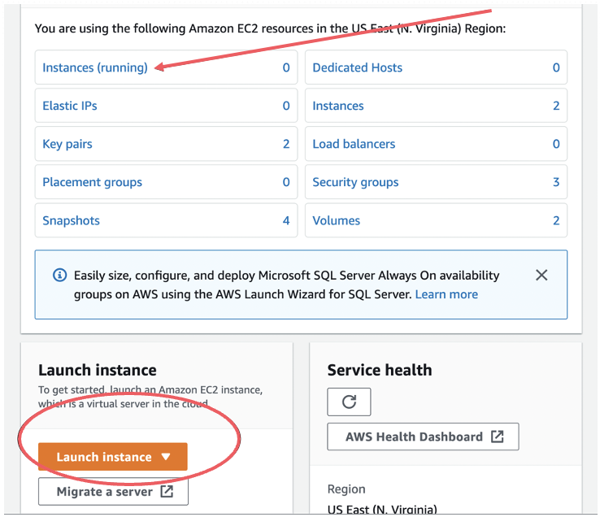

### Step 3: Name Your Instance

Give your instance a memorable name...

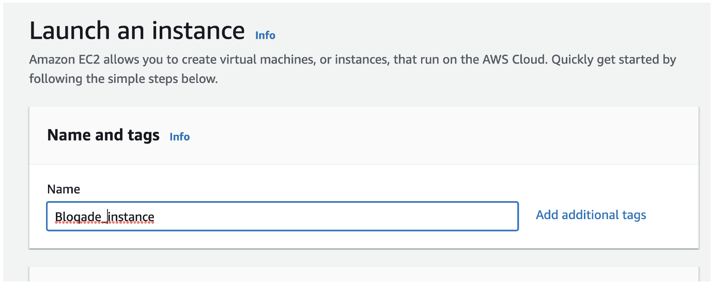

### Step 4: Choose an Image

...and choose Bloqade as an image. This will put the AMI on the instance which has Bloqade and all its dependencies ready to go.

To find the Bloqade image you can search for it by typing in "Bloqade" in the search bar: 

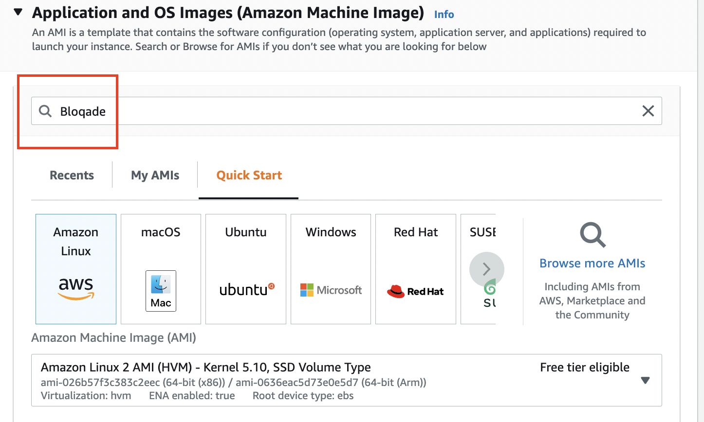

Upon hitting enter, ensure you're in the "AWS Marketplace AMIs" section and select which image you'd like to use:

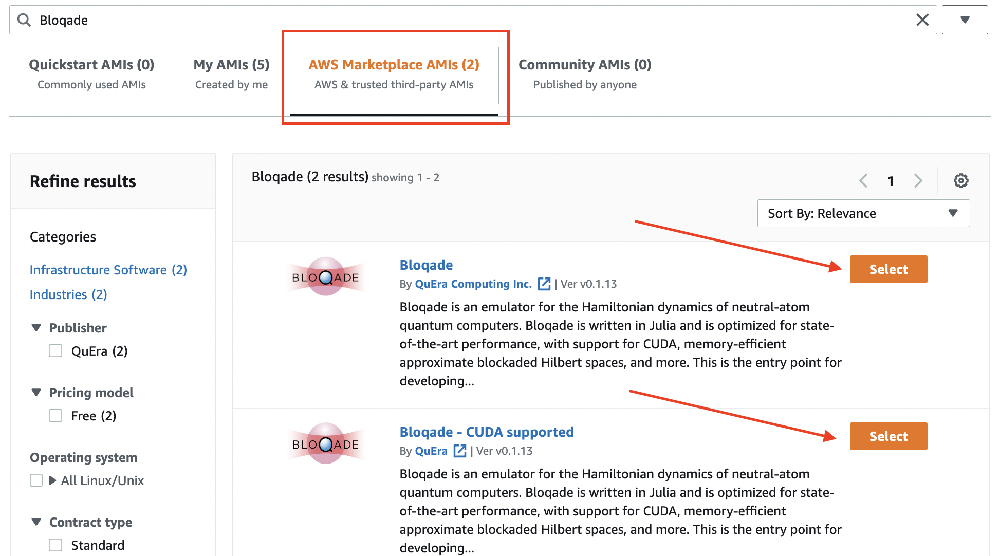

Upon reviewing the information on the AMI and hitting "Continue" you'll be returned to the Instance page to continue customizing it.

### Step 5: Select Your Instance

Select the EC2 instance type. Note that the rate at which your charged is dependent on which instance you select. Those with larger RAM/power usually charge more. For simple usage, we recommend an `m2.xlarge` instance as a basic choice. If you are looking for GPU support consider the `g4dn.xlarge` instance as a starting point.

More information on available instances and the ability to compare between them you can visit [instances.vantage.sh](https://instances.vantage.sh/).

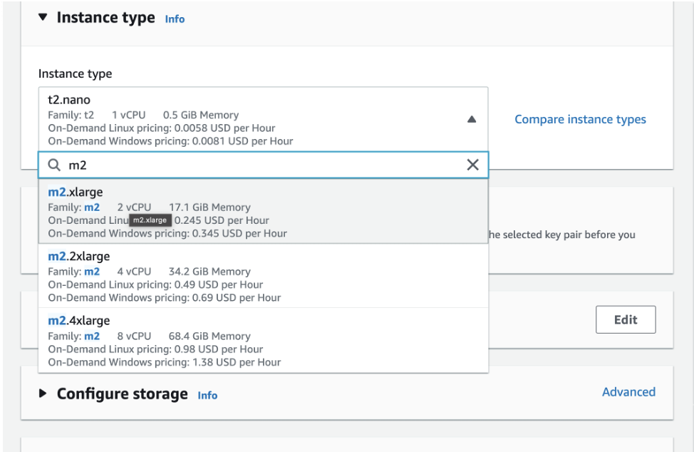

### Step 6: Generate a Key Pair

In order to access your instance from your local machine's terminal you will need to generate a key pair in advance. Click on "Create new key pair" as circled in the image. 

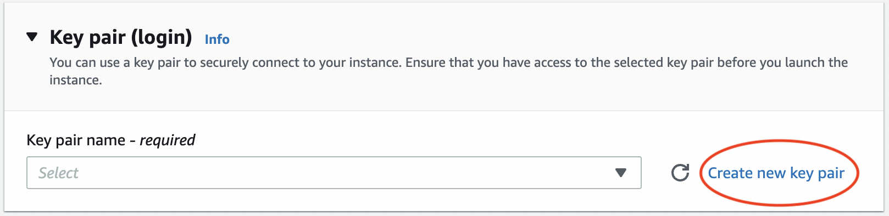

Give your key pair a memorable name and once you have selected your desirable key pair type and file format click "Create key pair".

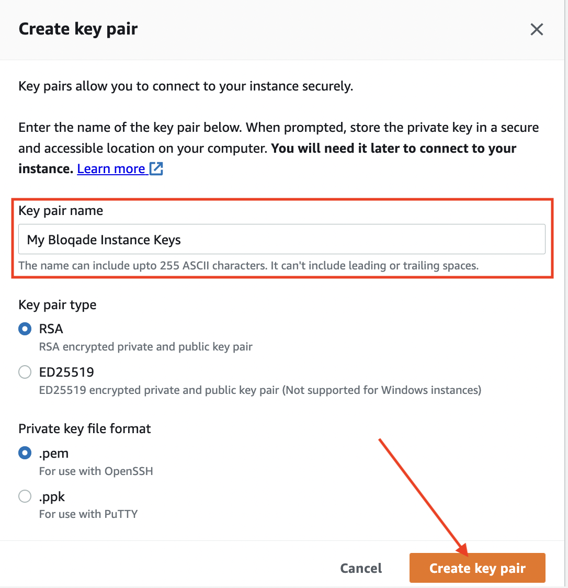

A download should happen in your browser that gives you your private key. If you are a PuTTY user you will need to import this key into your client. If you are are a Linux/macOS user using an SSH client from the terminal, you should put the key in your `~/.ssh` folder although any other location will work with the caveat being you will have to specify the exact path to the key when invoking `ssh` as an argument to the command.

You will also need to run the following command to set the proper permissions on the private key:
```bash
chmod 400 </path/to/your_key>
```

After launching your instance there will be two ways you can connect to it, shown in the later steps of this guide.

### Step 7: Tune Your Instance Some More

Select your security group. This depends on either your personal setup, company security practices, or AWS best practices.

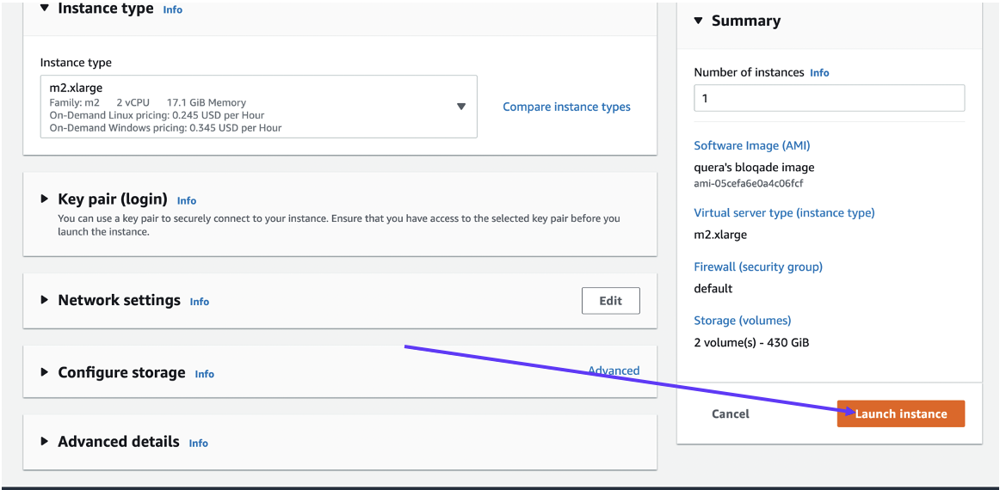

### Step 8: Blast Off!

Launch your instance!

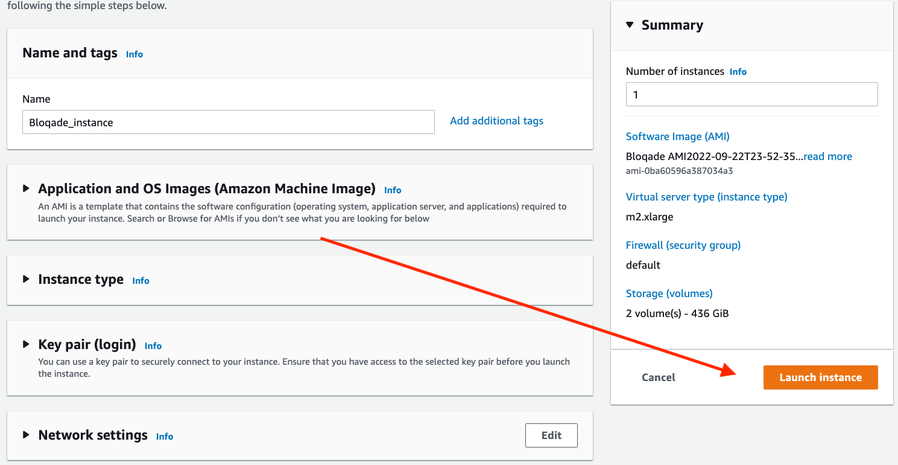

You should be presented with the following screen:

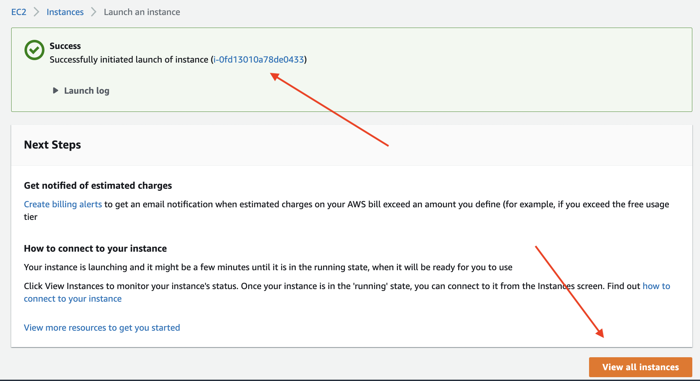

If you click on the instance hyperlink or the "View all instances" button, you'll be brought to the Instances page which shows all currently running as well as previously terminated/stopped instances. This page is also accessible from EC2 service page, 
accessible via the directions in [Step 2](#step-2-launch-your-instance).

Select your instance from the "Instances" menu by clicking the checkbox next to the desired instance. A "Connect" button should be clickable in the upper right corner.

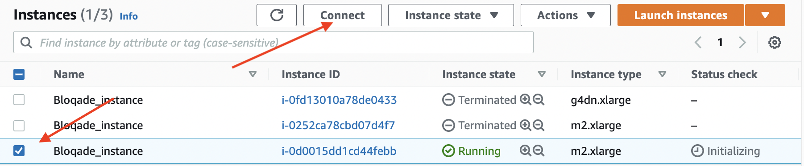

This should bring you to a "Connect to instance" page where you can navigate to the "SSH client" section.

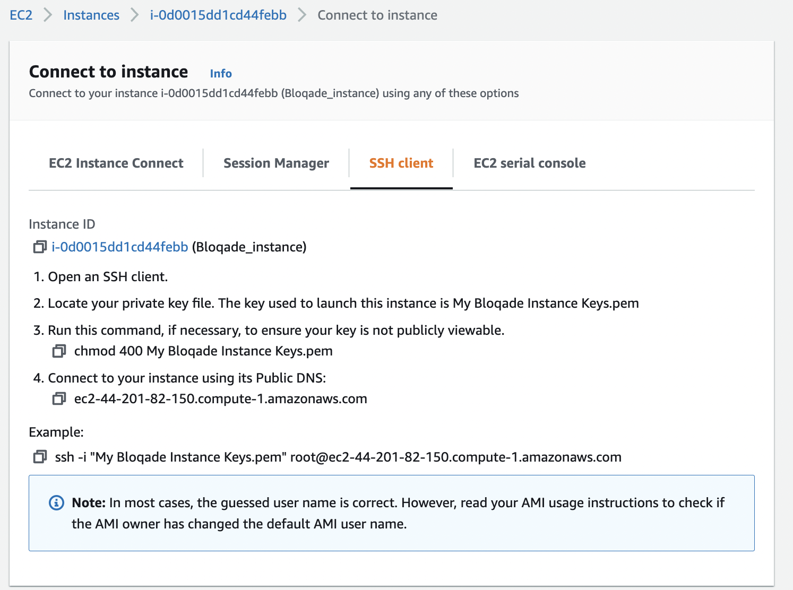

From here you have one of two choices to connect with your instance:

!!! warning "Default User Notice"
    When logging in to your EC2 instance, the recommended user to login as is the `ubuntu` user (the default, non-root user from the Ubuntu base images the Bloqade AMIs are based off of). Using `root` is not advised and unsupported by the Bloqade team. You will notice the "SSH Client" section in the photo above still gives the `ssh -i ...` command with "root" as the username. This must be changed to `ubuntu` IF you intended to use Option 1 below. Option 2 already accounts for this.

#### Option 1: Instant Command Line Access

If you just want to connect to the instance as fast as possible and plan on either:

- Keeping the instance alive for the duration of your work
- Terminating (the equivalent of completely deleting an instance) and starting new instances frequently

Just copy and paste the example at the very bottom (the command starting with `ssh -i ...`), changing the user to `ubuntu` from `root`. If your key is not located in the `~/.ssh` folder for Linux/macOS users, you will need to either navigate to the folder you have the key stored to in the command line and execute the command there OR specify the full path to the key as the string in front of `-i`. 


#### Option 2: OpenSSH Config File

If you plan on reusing the same instance (stopping and starting it, thereby preserving your work on the EBS (Elastic Block Storage), essentially the hard drive of your instance) instance that the EC2 instance uses by default, you can set defaults for signing in by creating (if the file does not exist)/editing (if the file does exist) your OpenSSH `config` found in your `~/.ssh` folder. Just add the following using `vim` or your favorite text editor:
```
Host AWS
    HostName <DNS NAME, ex: ec2-3-93-200-58.compute-1.amazonaws.com>
    User ubuntu
    IdentityFile ~/.ssh/<PATH TO YOUR KEY>.pem
```
You can find your DNS name by following the steps mentioned in Option 1 but focusing on Step 4, which is "Connect to your instance using its Public DNS".

Upon saving the changes, you should be able to access your instance by running `ssh AWS` in your command line.

### Step 9: Shutting Down Your Instance

In order to shut down your instance, you can return to the "Instances" menu shown in [Step 8](#step-8-blast-off), select your instance, and click the "Instance State" Drop down. 

You can either:
- Stop your Instance - This preserves any files you may have created working in the instance that were on the EBS but will come at a cost, determinable [here](https://aws.amazon.com/ebs/pricing/). You may reuse the instance by selecting it again in the "Instances" menu and selecting "Start".
- Terminating your Instance - This does NOT preserve any files and means you will lose any work not transferred off the instance to your local machine. Termination deletes the EBS instance that your instance uses and you will not be charged afterwards for storage.

  
## Build System Images to Accelerate Start-up Time

Since Bloqade is a large package, its loading time
and time-to-first-simulation can be very long.
You can build system images to save all the compilation
results in a binary to accelerate its loading/compilation
time. This is useful when you have lots of interactive
programming needs with Bloqade.

To build a system image for your environment, please use
the [PackageCompiler](https://julialang.github.io/PackageCompiler.jl/dev/)
or use the Julia VSCode plugin's [build system image feature](https://www.julia-vscode.org/docs/stable/userguide/compilesysimage/)

## Contributing to Bloqade 

Please `git clone` this repository to a directory of your choice on your local machine and refer to [Contributing to Bloqade](@ref contrib) to see how to set up your development environment for Bloqade.
