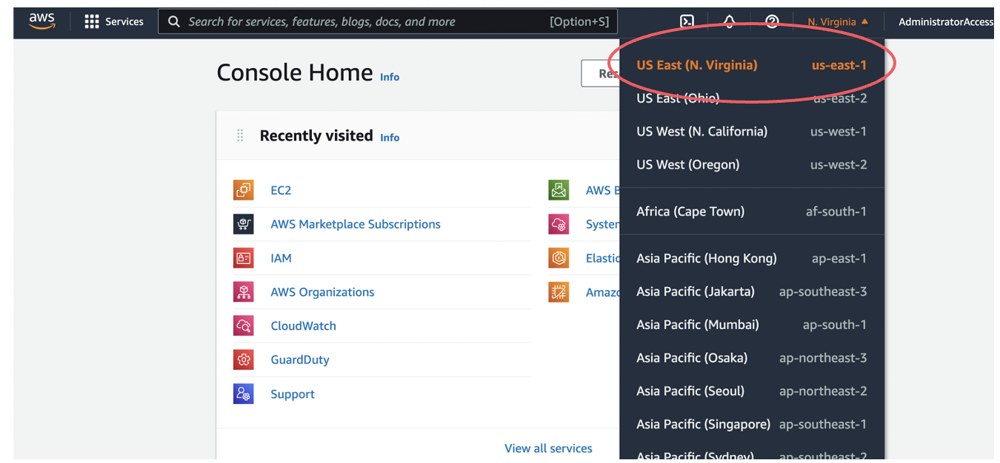

# [Installation](@id install)

You can copy the following line to your Julia REPL
to install the latest stable version of this package:

```julia
pkg> add Bloqade
```

## Low-Latency Usage of Bloqade Component Packages

The Bloqade project contains multiple packages. For development on top of functionality,
(especially for those who do not need the ODE solvers), we recommend you use the corresponding
component packages. The following is a list of component packages and what they do (WIP = work-in-progress)

- BloqadeExpr: Expressions and API definitions for Bloqade.
- BloqadeKrylov: Krylov-subspace based emulation.
- BloqadeLattices: objects, functions for lattices.
- BloqadeMIS: tools for working with maximum-independent sets in Rydberg system.
- BloqadeODE: ODE-based emulation.
- BloqadePython: WIP, python wrapper for the Bloqade package.
- BloqadeQMC: WIP, Stochastic Series Expansion for Rydberg system.
- BloqadeSchema: WIP, the schema for creating a task for Bloqade and QuEra machine.
- BloqadeWaveforms: the waveform objects.
- YaoSubspaceArrayReg: register object and functions in a subspace.

All the non-WIP packages are registered in the General registry. Thus, you can add them
as your dependency by directly running `pkg> add <component package>` in your Julia REPL.

## Try the Latest Version of Bloqade

Some users may want to try the latest version of Bloqade
for bug fixes, new features, etc. One can use `git` to clone the
repo to try the latest version of the entire package. This
requires one to setup the local project environment via `dev`.
Please refer to the page [Contributing to Bloqade](@ref) for more information.

If you only want to try the latest version of a specific
Bloqade package, just add `#master` after the package name, e.g.:

```julia
pkg> add BloqadeExpr#master
```

## Using Bloqade with AWS EC2

Bloqade can be deployed on any personal computer although some users might benefit from the extra performance offered by large computational resources from different providers. To address that, Bloqade is also available on the Amazon Web Services (AWS) Marketplace, and can run on AWS EC2 instances Amazon Machine Images (AMIs). More information about the AMIs and how to deploy them onto EC2 instances can be found below.

### Bloqade AMIs

There are two AMIs offered by the Bloqade team:

#### Bloqade AMI with Julia (Base Image)

Built on top of Ubuntu Server 20.04 LTS, this image includes
- The latest version of Julia and Bloqade
- [Yao.jl](https://yaoquantum.org/)
- [Revise.jl](https://github.com/timholy/Revise.jl)
- [BenchmarkTools.jl](https://juliaci.github.io/BenchmarkTools.jl/stable/)
- [PythonCall.jl](https://cjdoris.github.io/PythonCall.jl/stable/) 
- Conda package manager, provided by [Miniconda](https://docs.conda.io/en/latest/miniconda.html) 

#### Bloqade Optimized Deep Learning AMI with CUDA Support

Built on top of an Amazon DLAMI (Deep Learning AMI) on Ubuntu 20.04, this AMI includes everything from the Base Image above along with:

- NVIDIA CUDA, cuDNN, NCCL, GPU Drivers, Intel MKL-DNN, Docker, NVIDIA-Docker, and EFA support
- Support for Block devices

as well as:

- [CUDA.jl](https://github.com/JuliaGPU/CUDA.jl)
- [Adapt.jl](https://github.com/JuliaGPU/Adapt.jl) 

Both of which are needed for Bloqade to take advantage of GPUs (see [GPU Acceleration](@ref) for more on how to do this). 


### Disclaimers

- Deploying Bloqade on AWS EC2 instances will incur a cost on the user that will depend on the AWS resources utilized.  
- Support on deploying Bloqade on AWS can be obtained via AWS Support. This is a one-on-one support channel that is staffed 24x7x365 with experienced support engineers. To learn more, follow [this link](https://aws.amazon.com/premiumsupport/).

### Step 0: Set Your AWS Region

For general guidelines on launching EC2 instances, check out the [AWS EC2 tutorial](https://docs.aws.amazon.com/AWSEC2/latest/UserGuide/EC2_GetStarted.html).
Bloqade can technically be run from any location but its images are hosted on servers in AWS' North Virginia (N. Virginia) region. To get started as easily as possible, set your AWS region location to N. Virginia (us-east-1).



### Step 1: Access the EC2 Service

Now to really get started. On your AWS account portal, type EC2 on the search bar and access the EC2 service


### Step 2: Launch Your Instance

Find the "Launch Instance" button, circled in red, to create one. To see all currently running instances, click the "Instances (running)" button, indicated by the red arrow.


### Step 3: Name Your Instance

Give your instance a memorable name...


### Step 4: Choose an Image

...and choose Bloqade as an image. This will put the AMI on the instance which has Bloqade and all its dependencies ready to go.


### Step 5: Tune Your Instance

Select the EC2 instance type. Note that the rate at which your charged is dependent on which instance you select. Those with larger RAM/power usually charge more. For simple usage, we recommend an `m2.xlarge` instance as a basic choice. If you're looking for GPU suport consider the `g4dn.xlarge` instance as a starting point.


### Step 6: Tune Your Instance Some More

Select your security group. This depends on either your personal setup, company security practices, or AWS best practices.


### Step 7: Blast Off!

Launch your instance and Bloqade away!


#### SSH Access

- On step 7, a Key pair can be created for SSH access, if the user does not have a previously created one.
- In this case, it is recommended to access Key pair (login) and click “Create new key pair”. Following the instructions, one may download a `.pem` file which can be added to the user’s `~/.ssh` folder. 
- Run the following command: `chmod 400 <path/to/your_key>`
- Following this process, a default SSH protocol for sign in and security can be used.)
    * Do so by accessing `vim config` on your shell and typing the following
 
You can find your DNS name  by clicking your instance on the list of running instances in the dashboard, clicking “Connect” and copying the “Public DNS” in the SSH Client tab.

Then exit vim and type `SSH AWS`

  
## Build System Image to Accelerate Start-up Time

Since Bloqade is a large package, its loading time
and time-to-first-simulation can be very long.
You can build system images to save all the compilation
results in a binary to accelerate its loading/compilation
time. This is useful when you have lots of interactive
programming needs with Bloqade.

To build a system image for your environment, please use
the [PackageCompiler](https://julialang.github.io/PackageCompiler.jl/dev/)
or use the Julia VSCode plugin's [build system image feature](https://www.julia-vscode.org/docs/stable/userguide/compilesysimage/)


## Developing Bloqade

When developing Bloqade, one will need to setup a local environment
that contains all the local changes. To work with the Bloqade repo,
first you need to clone this repo

```sh
# clone this repo
git clone https://github.com/QuEraComputing/Bloqade.jl.git Bloqade
# go into the directory
cd Bloqade
# dev the corresponding environment
.ci/run dev
```

How does this work? The `.ci/run dev` command actually calls the `Pkg.develop`
command from Julia's package manager. Because we want to use the local
changes of the package, one will need to `dev` the corresponding package to 
make the changes happen in your current environment, e.g one will need to `dev` 
the `lib/BloqadeExpr` package to apply changes in `BloqadeExpr` module.

We also provide a convenient tool to setup this more automatically by
looking up dependencies in `lib` in one's `Project.toml` file,

```sh
.ci/run dev <path/to/your/environment>
```

will `dev` all the Bloqade dependencies in your environment.

See also [Modifying A Dependency](https://pkgdocs.julialang.org/v1/getting-started/#Modifying-A-Dependency)
for more detailed explainations.
