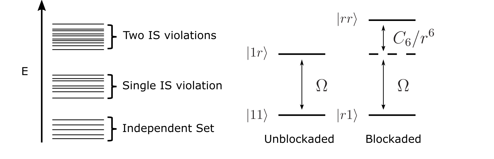
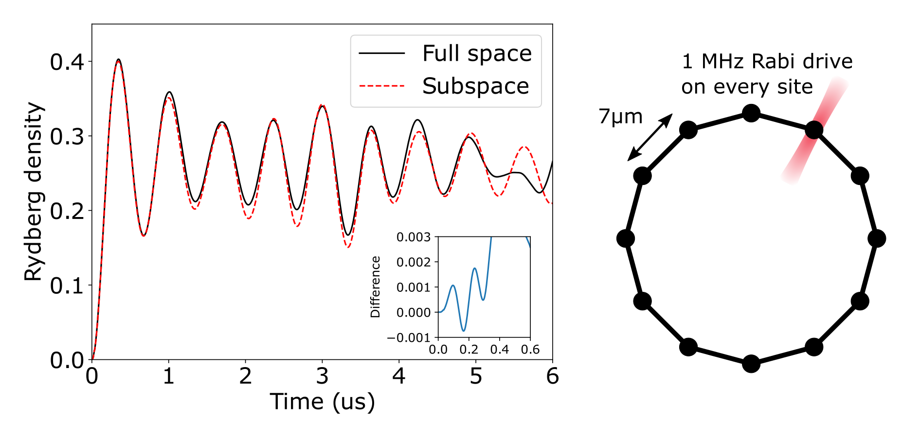

# [Rydberg Blockade](@id blockade)

The Rydberg blockade mechanism is a crucial component of the operation of neutral atom computers. By including a term in the effective Hamiltonian which adds an interaction between adjacent Rydberg atoms, we may construct gates and nontrivial dynamics which create entanglement and correlation across the system.

The term is a van der Waals interaction where there is an energy shift if two adjacent atoms are in the Rydberg state. The Van der Waals interaction is

```math
V_{ij} = \frac{C_6}{|\vec r_i - \vec r_j|^6}\hat n_i \hat n_j
```

where ``\hat n_i=|r_i\rangle\langle r_i|`` is the number operator on the ``i``th site, which is 1 if the atom is in the Rydberg state, and zero if the atom is in the ground state. The coefficeint ``C_6 = 2\pi\times 862690 MHz/\mu m^6`` is the interaction strength; characteristically, this interaction has a strength ``\approx 10MHz`` for two atoms seperated by ``10\mu m``, a similar scale to the Rabi coupling between the ground and Rydberg state. Crucially, this can be seen as an energy shift on atom ``j``, conditional on the state of atom ``i``, and so can be used, in a loose sense, as a conditional logical gate. This is because the adjacent atom forces the atom to be off-resonant with the laser field.

This conditional drive can be seen given the following dynamics. Suppose two atoms are close to each other (``< 10 \mu m``) and so interact under van der Waals. The left atom is either in a Rydberg state, or in the ground state, and the right atom is originally in the ground state. Then, a Rabi drive is applied to the right atom, which couples the atom's ground state to the Rydberg state. For this example, we choose a Rabi drive of ``\Omega=2\pi\times 0.5``MHz and distance between atoms ``|\vec r_i- \vec r_j| = 7\mu m``, which gives a conditional detuning of ``\approx 50``MHz. When the left atom is in the ground state (black, top), there are no interactions and the state of the right atom oscillates between the ground state and Rydberg state; for a particular choice of timing this executes a ``\pi`` pulse, flipping the right atom from the ground to Rydberg state. However, when the left atom is in the Rydberg state (red, bottom), there is a large detuning on the right atom, which causes the transfer to the Rydberg state to be strongly suppressed. In this case, the right atom (up to perturbative corrections) is never in the Rydberg state.


This conditional energy shift is the basis of the **Rydberg Blockade**. Because of the large energy shift from having two adjacent atoms in the Rydberg state, evolution from an atomic ground state with local Rabi couplings between ground and Rydberg is restricted to a low energy subspace of states where no two adjacent atoms are in the Rydberg state. Furthermore, because the interaction strength with distance is a large power law, one can define a characteristic scale set by the Rabi coupling. If two atoms are close such that the conditional detuning is much larger than the Rabi coupling, one can consider the atoms to be blockading each other, and both atoms cannot simultaniously be in the Rydberg state. In contrast, if two atoms are far away, the two atoms never blockade each other and both atoms can simultaniously be in the Rydberg state.

## Energy truncation and Blockade subspace



In this way, the low energy classical states of the Rydberg Hamiltonian (``\Omega=0``, ``\Delta=0``) for a given array of atoms are **independent sets** of a **unit disk graph** defined by the positions of the atoms. A unit disk graph is a set of vertices and edges, where vertices represent every atom, and there are edges if the distance between vertices is less than some radius ``|\vec r_i- \vec r_j|<R``. The lowest energy states are representative of independent sets, where Rydberg excitations are in the independent set and no two Rydberg excitations are within some radius. The second energy band are sets with a single independent set violation, where there is equivalently two Rydberg excitations within the unit disk radius of each other. Higher and higher bands represent more and more independent set violations. Note that this band structure is dependent on the arrangement of atoms, and for arbitrary configurations this band structure may not be clear.

Instead of doing quantum dyanamics in the full ``2^N`` Hilbert space, we may take advantage of the energy structure of the classical Hamiltonian to reduce the computational difficulty. The simplest scheme is to truncate the Hilbert space to the low energy subspace, and exclude all states above a certain energy. Given the natural band structure of the classical Hamiltonian, we may simply truncate the Hilbert space to the subspace of independent sets of the unit disk graph. Equivalently, this is the **blockade subspace**, where atoms within the blockade radius are excluded from both being in the Rydberg state.


The validity of the energy truncation subspace is governed by the strength of off-diagonal matrix elements coupling the low energy subspace to the high energy one. For the Rydberg Hamiltonian, these off-diagonal elements ``|1r\rangle\leftrightarow|rr\rangle`` have a strength ``\Omega``. In order to preserve dynamics within the subspace, the energy difference between states within the blockade subspace (eg, ``|1r\rangle``) and outside (``|rr\rangle``) must be much larger than the Rabi strength. Formally,

```math
\Omega \ll \frac{C_6}{R^6}
```
where ``R`` is the blockade radius. As long as this condition holds, the exact dynamics in the full Hilbert space should be closely approximated by the approximate dynamics in the blockade subspace, as the mixing terms only couple to low energy states.

## Example dynamics in the blockade subspace

To emphisize the effectiveness of this independent set subspace, some example nonequilibrium dynamics are shown below, for a ring of 12 atoms seperated by ``7\mu m``. Given a blockade radius of ``R=7\mu m``, the energy scale is set to be ``\Omega \ll 7.296``MHz. This set of atoms can be defined by

```@example blockade
using Bloqade
nsites = 12;    # 12 site chain
distance = 7    # Distance between atoms, in microns

R = distance/(2*sin(2*pi/(nsites)/2))                                       # Radius of the circle, using a little trigonometry
pos = [(R*sin(i*2*pi/(nsites)), R*cos(i*2*pi/(nsites)) ) for i in 1:nsites] # Positions of each atom
atoms = AtomList(pos)                                                       # Define the atom positions as an AtomList.
```

The system is driven by a constant ``0.5``MHz Rabi drive, which couples each atom's ground and Rydberg state. This is well within the perturbative limits set by the subspace, as ``0.5``MHz``\ll 7.296``MHz and so the blockade subspace should approximate exact dynamics faithfully. The Hamiltonian can be defined in bloqade with

```@example blockade
h = rydberg_h(atoms;C = 2π * 858386, Ω=2*π * 0.5)
```


The system is initialized into the ground state of all atoms, which is the lowest energy of the classical Hamiltonian. We have two choices of basis: the first choice is the full Hilbert space of ``2^{12}`` elements, wheras the second basis is the blockade subspace, which excludes Rydberg excitations within the unit disk radius. The blockade subspace has ``D=322`` elements, which means that computation is much faster.

```@example blockade
init_state = zero_state(nsites)                 # Initial state in the full space
space = blockade_subspace(atoms,distance*1.1)   # Compute the blockade subspace
init_state2 = zero_state(space)                 # Define the initial state in the blockade subspace.
```

If the atoms were far apart and non-interacting, each atom would oscillate completely between its ground state and Rydberg state with a period of ``0.5 \mu``s. However, because adjacent atoms shift to the Rydberg state concurrently, they are dynamically blockaded, causing the maximum Rydberg density to only be 1/2, corresponding to an antiferromagnetic ``Z_2`` state. Note that because the ring has a translation symmetry, the Rydberg density is equal on all sites.

```@example blockade
# Define the time steps
Tmax = 10.
nsteps = 5001
times = LinRange(0,Tmax,nsteps)


# Time evolve the system in the full space
prob = SchrodingerProblem(init_state, Tmax, h, dt = Tmax/(nsteps-1) , adaptive = false);
integrator = init(prob, Vern6());

densities = []
for _ in TimeChoiceIterator(integrator, 0.0:Tmax/(nsteps-1):Tmax)
    push!(densities, expect(put(nsites, 1=>Op.n), init_state))
end


# Time evolve the system in the subspace
prob2 = SchrodingerProblem(init_state2, Tmax, h, dt = Tmax/(nsteps-1) , adaptive = false);
integrator2 = init(prob2, Vern8());

densities2 = []
for _ in TimeChoiceIterator(integrator2, 0.0:Tmax/(nsteps-1):Tmax)
    push!(densities2, expect(put(nsites, 1=>Op.n), init_state2))#, SubspaceArrayReg(u, space)))
end


# Plot the data
fig = plt.figure(figsize=(8,6))
ax  = plt.subplot(1,1,1)

plt.plot(times,real(densities),"k",label="Full space")
plt.plot(times,real(densities2),"r--",label="Subspace")
ax.axis([0,Tmax,0,0.45])
plt.xlabel("Time (us)")
plt.ylabel("Rydberg density")
plt.tight_layout()
plt.legend()

# Using matplotlib plots
inset_axes = pyimport("mpl_toolkits.axes_grid1.inset_locator")
ax2 = inset_axes.inset_axes(ax,width="20%",height="30%",loc="lower right",borderpad=1)
plt.plot(times,real(densities - densities2))
plt.axis([0,0.6,-0.0008,0.0008])
plt.ylabel("Difference",fontsize=12)
plt.yticks(LinRange(-0.0008,0.0008,5),fontsize=12)
plt.xticks([0,0.2,0.4,0.6],fontsize=12)
```



Data for this evolution is shown above, where exact evolution in the full space is shown in black, and the truncated evolution in the subspace is shown by red dashed. It is clear that even though the Hilbert space is ``12\times`` smaller, the dynamics are faithfully reproduced, up to high frequency oscillations (inset) from adjacent atoms in the Rydberg state, similar to the high frequency oscillations of the 2 atom conditional blockade example. However, at longer times this subspace approximation fails to reproduce the full space (shown by divergence between black and red dashed). Note that for this example, the distance between atoms was chosen to be in an intermediate regime (eg, at the edge of the unit disk), which reduces the blockade effect and amplifies the approximate nature of the blockade. If the atoms were chosen to be closer together (say, ``5\mu m``) or the Rabi strength was reduced, the blockade approximation becomes much stronger.

